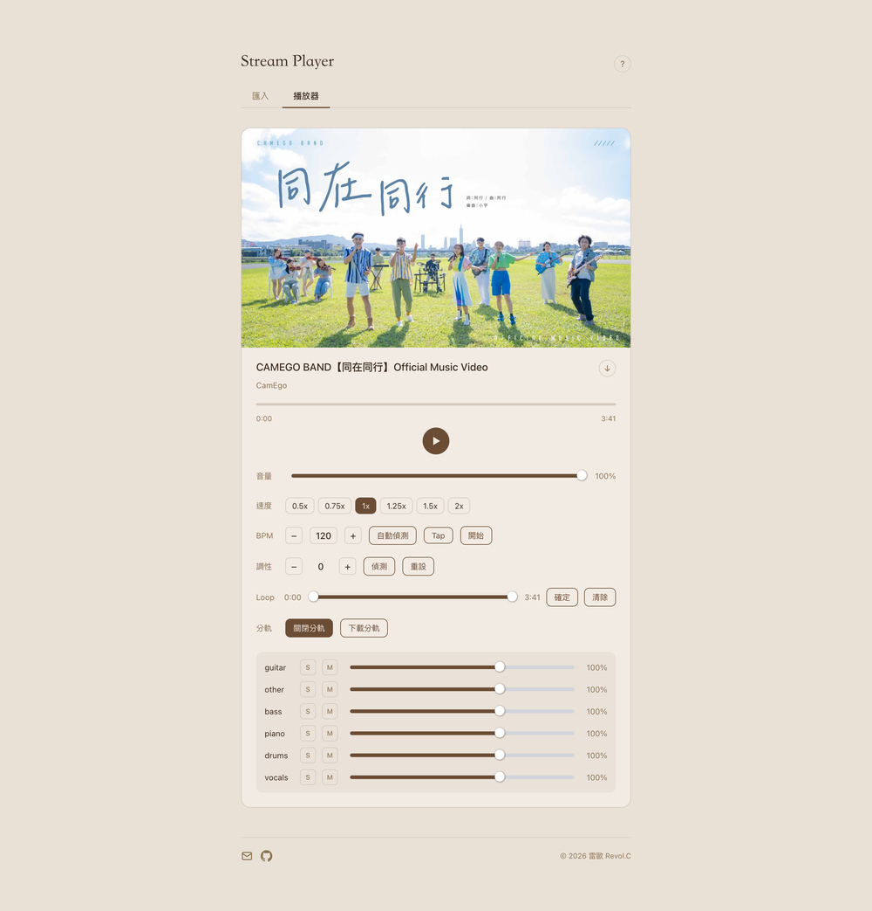

# Stream Player

A web-based music practice tool for musicians and singers — loop sections, detect BPM and key, transpose in real time, and separate stems.

> **中文簡介**：網頁版音樂練習工具，支援 Loop 區間反覆練習、BPM / 調性偵測、即時移調、Demucs 六軌分軌。介面為繁體中文。

**Live demo:** https://stream.revolchu.com

---

## Features

### Playback

- Loop any section with a dual-handle range slider
- Speed control (0.5×–2×) without affecting pitch
- Volume control with keyboard shortcuts

### Analysis

- **BPM detection** via librosa, with beat-sync metronome and tap tempo
- **Key detection** (Krumhansl-Schmuckler algorithm on chroma features)

### Transpose

- Real-time pitch shifting ±12 semitones using SoundTouch AudioWorklet
- Speed and pitch are fully independent

### Stem Separation

- 6-track separation (vocals, drums, bass, guitar, piano, other) via Demucs (`htdemucs_6s`)
- Per-track volume, mute, and solo controls
- Download all stems as a ZIP

### Import

- Paste a URL from SoundCloud, Bandcamp, Bilibili, StreetVoice, NicoNico, or Mixcloud
- Upload a local audio file via drag & drop
- YouTube search built in — download with any browser-based tool and drag the file in

### Keyboard Shortcuts

| Key     | Action               |
| ------- | -------------------- |
| `Space` | Play / Pause         |
| `← →`   | Seek ±5 seconds      |
| `0`–`9` | Jump to 0%–90%       |
| `< >`   | Speed −/+            |
| `- =`   | Volume −/+ 5%        |
| `\`     | Reset volume to 100% |
| `/`     | Focus search         |
| `?`     | Help modal           |

---

## Tech Stack

### Frontend

|                |                                                                                             |
| -------------- | ------------------------------------------------------------------------------------------- |
| Framework      | Vue 3 + TypeScript + Vite                                                                   |
| Pitch shifting | [`@soundtouchjs/audio-worklet`](https://github.com/cutterbl/SoundTouchJS) via Web Audio API |
| Metronome      | Tone.js                                                                                     |
| Slider         | @vueform/slider                                                                             |
| Utilities      | VueUse                                                                                      |

### Backend

|                    |                                                                                                 |
| ------------------ | ----------------------------------------------------------------------------------------------- |
| Framework          | FastAPI (Python 3.12)                                                                           |
| Audio download     | yt-dlp + ffmpeg                                                                                 |
| BPM / Key analysis | librosa, NumPy, SciPy                                                                           |
| Stem separation    | [Demucs](https://github.com/facebookresearch/demucs) via [Replicate API](https://replicate.com) |

### Infrastructure

|          |                                  |
| -------- | -------------------------------- |
| Frontend | Vercel                           |
| Backend  | Linode (Ubuntu, systemd + nginx) |
| SSL      | Let's Encrypt via certbot        |

---

## Architecture Notes

- Shared constants (upload limits, max duration, etc.) live in `shared/constants.json` as a single source of truth, imported by both frontend and backend.
- Stem separation is handled entirely by Replicate (async polling) — no GPU required on the server.
- BPM and key analysis run locally on the backend with librosa; concurrency is limited via asyncio semaphore to avoid CPU saturation.
- Transposition uses a Web Audio worklet so pitch shifting is real-time and non-destructive, independent of playback speed.
